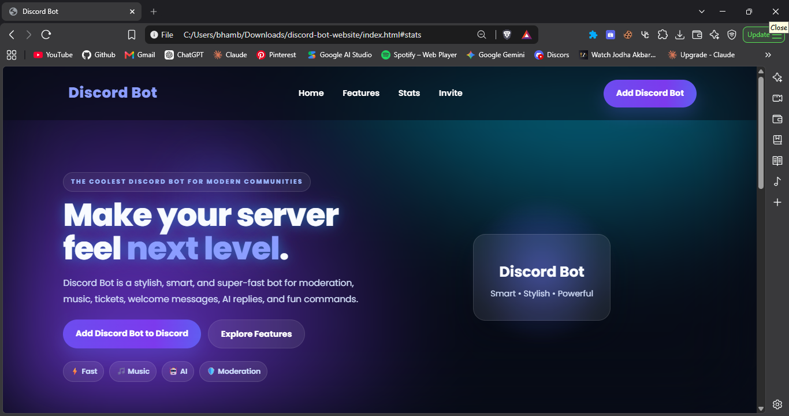

# 🚀 Discord Bot Landing Page

A modern, responsive, and animated Discord Bot Landing Page built with HTML, CSS, and JavaScript.

Designed for developers who want a beautiful website to showcase their Discord bot.

---

## 📸 Preview

<p align="center">
  
</p>

---

## ✨ Features

- 🎨 Modern Discord-inspired UI
- 🌌 Animated Gradient Background
- 💎 Glassmorphism Design
- ✨ Smooth Hover Animations
- 🚀 Floating Hero Animation
- 📈 Animated Statistics Counter
- 🖱️ Mouse Glow Effect
- 📱 Fully Responsive
- ⚡ Lightweight & Fast
- 🎯 Easy to Customize
- 🌙 Dark Theme
- ❤️ Clean Code Structure

---

## 🛠️ Built With

- HTML5
- CSS3
- JavaScript (ES6)

---

## 📂 Folder Structure

```text
discord-bot-landing-page/
│
├── assets/
│   └── preview.png
│
├── index.html
├── style.css
├── script.js
├── LICENSE
└── README.md
```

---

## 🚀 Getting Started

### Clone the Repository

```bash
git clone https://github.com/immortal-ip/discord-bot-landing-page.git
```

### Go to Project Folder

```bash
cd discord-bot-landing-page
```

### Run the Website

Simply open index.html in your favourite browser.

No installation required.

---

## 🎨 Customization

You can easily customize:

- Bot Name
- Logo
- Navigation
- Hero Section
- Colors
- Buttons
- Features
- Statistics
- Footer
- Background
- Animations

---

## 📱 Responsive

Works perfectly on:

- 💻 Desktop
- 🖥️ Laptop
- 📱 Mobile
- 📟 Tablet

---

## ⭐ Why Use This Template?

- Beginner Friendly
- Professional Design
- No Framework Required
- Fast Loading
- Clean & Organized Code
- Perfect for Discord Bots

---

## 🤝 Contributing

Contributions are welcome!

1. Fork the repository
2. Create a new branch

```bash
git checkout -b feature-name
```

3. Commit your changes

```bash
git commit -m "Add new feature"
```

4. Push to GitHub

```bash
git push origin feature-name
```

5. Create a Pull Request

---

## 📝 License

This project is licensed under the MIT License.

You are free to use, modify, and distribute this project.

---

## ⭐ Show Your Support

If you like this project, please consider giving it a ⭐ on GitHub.

It helps the project grow and motivates future updates.

---

## 👨‍💻 Author

Made with ❤️ by Akshay Jaat

GitHub: https://github.com/immortal-ip

---

## 📬 Contact

Have suggestions or found a bug?

Feel free to open an Issue or submit a Pull Request.

---

<div align="center">

### ⭐ Thanks for Visiting ⭐

**Happy Coding! 🚀**

</div>
